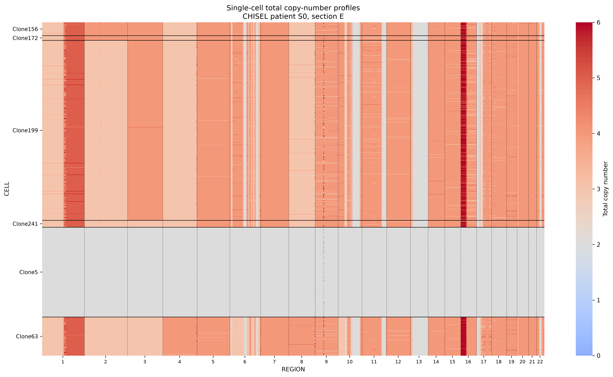
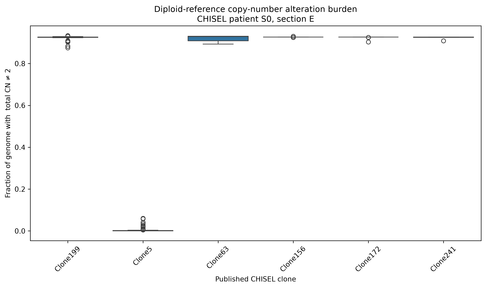
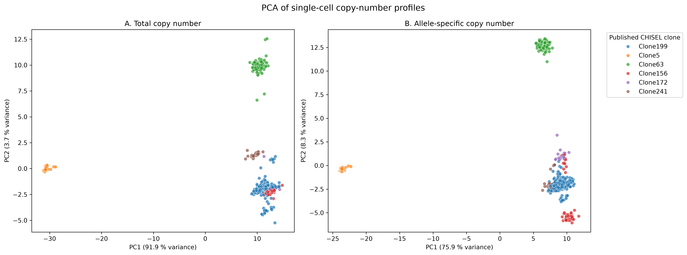
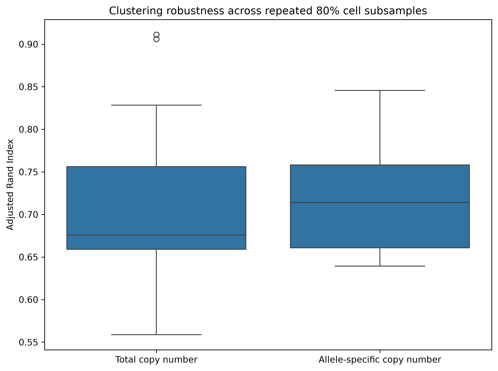

# Reanalysis of CHISEL single-cell copy-number data

## Overview

This project explores whether simple statistical analysis of processed single-cell DNA copy-number data can recover tumour clone structure reported by CHISEL.

CHISEL infers allele- and haplotype-specific copy-number states from single-cell DNA sequencing and uses these profiles to investigate intra-tumour heterogeneity.

I reanalysed processed data from patient S0, tumour section E.

## Question
To what extent can simple PCA and hierarchical clustering of copy-number profiles reproduce the tumour clone structure reported by CHISEL?

## Data 
The analysis used publicly available processed CHISEL outputs.

The dataset contained 2,075 cells. 1,448 of these had published assignments to six tumour clones. Copy-number profiles covered 570 genomic regions.

## Analysis
Total copy number was calculated from the two haplotype-specific copy numbers for each genomic region.

The analysis included:
-Genome-wide copy-number visualisation
-PCA of total copy number
-Ward hierarchical clustering
-Comparison with published clone assignments using adjusted Rand index
-PCA and clustering using allele-specific copy numbers
-Robustness analysis using 100 stratified random subsamples containing 80% of cells from each published clone.

## Results
Simple total-copy-number analysis recovered substantial published clone structure.

The first two total-copy-number principal components explained 91.9% and 3.7% of variance, respectively.

Ward hierarchical clustering achieved an adjusted Rand index of 0.792 relative to the published CHISEL clone assignments.

Some clones were recovered particularly clearly, including Clone5 and Clone63. However, total-copy-number clustering merged Clone156 and Clone172.

Retaining allele-specific copy numbers revealed additional separation between Clone156 and Clone172 in PCA. On the complete dataset, however, allele-specific clustering showed almost identical agreement with the published CHISEL assignments (ARI = 0.791).

Across 100 stratified 80% cell subsamples:
- Total-copy-number clustering had a median ARI of 0.676, with a 95% resampling interval of 0.569-0.816.
- Allele-specific clustering had a median ARI of 0.714, with a 95% resampling interval of 0.640-0.816.
- The paired median difference in ARI was 0.008, with a 95% resampling interval of -0.129 to 0.180.
- Allele-specific clustering achieved a higher ARI in 53% of subsamples.

These results suggest that allele-specific information reveals additional genomic structure. However, it does not consistently improve recovery of published clone assignments under simple Ward hierarchical clustering.

## Figures
### Figure 1 - Genome-wide copy-number profiles

### Figure 2 - Diploid-reference copy-number alteration burden 

### Figure 3 - Total vs allele-specific PCA

### Figure 4 - Clustering robustness

## Limitations
This project begins with copy-number states inferred by CHISEL rather than raw sequencing reads. Therefore, it does not independently validate CHISEL's copy-number inference.

Only one patient section was analysed.  The results should not be interpreted as a general assessment of CHISEL performance.

The diploid-reference alteration metric treats total copy number two as baseline and therefore requires caution in cells with altered baseline ploidy or whole-genome duplication.

PCA provides a linear representation of genomic variation and does not explicitly model tumour evolutionary relationships.

Ward hierarchical clustering uses Euclidean distance and does not reproduce the specialised clone-inference procedure used by CHISEL.

## Purpose
This repository is an independent educational reanalysis of publicly available processed data. It is not original research and is not an attempted reimplementation of CHISEL.
